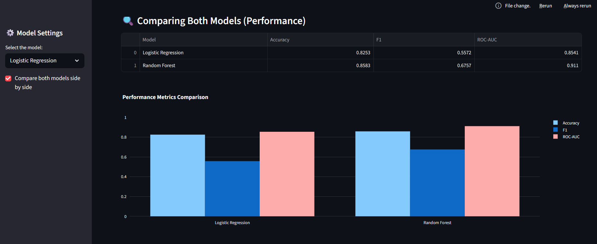
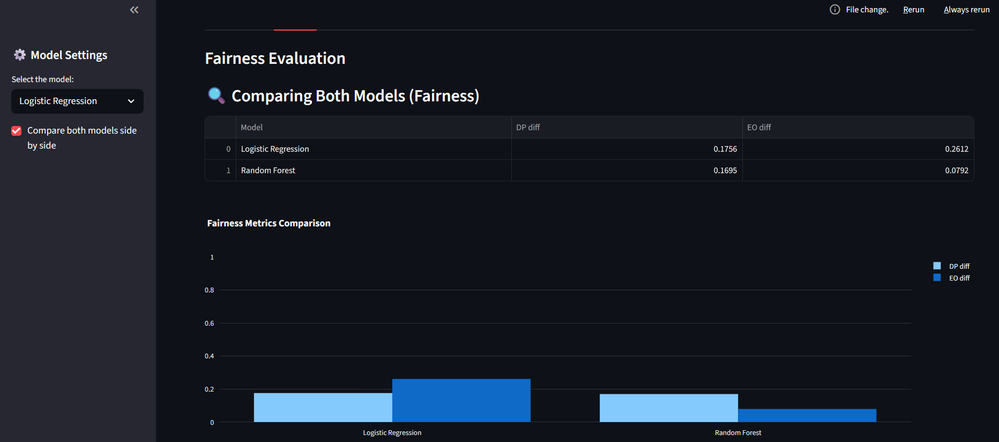
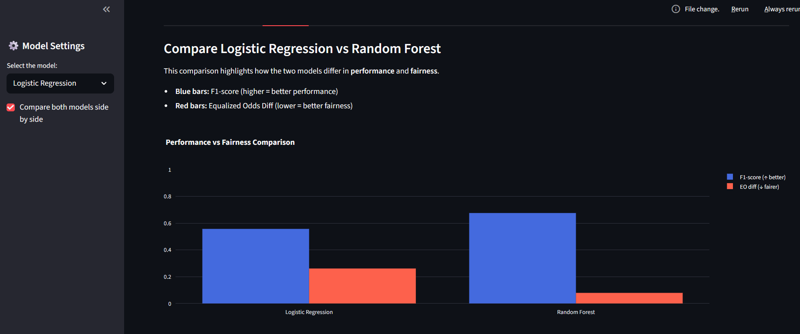
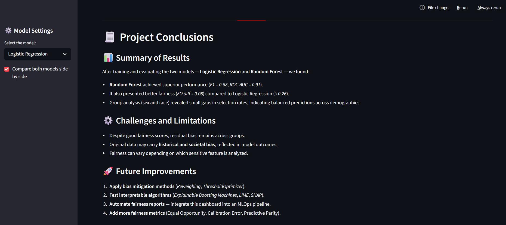

🧠 AI Monitoring & Ethics Dashboard

A professional end-to-end Responsible AI project that demonstrates how to monitor, evaluate, and mitigate bias in machine learning models using Fairlearn and SHAP, and visualize results through an interactive Streamlit dashboard.

📋 Project Overview

This project shows how organizations can apply Responsible AI principles by detecting and mitigating algorithmic bias.
It uses the Adult Income Dataset to predict whether an individual earns more than $50K/year, while ensuring fairness across sensitive attributes such as gender and race.

⚙️ Tech Stack

🐍 Python 3.11

🤖 Scikit-learn – model training (Logistic Regression + Random Forest)

⚖️ Fairlearn – fairness evaluation & mitigation

🧩 SHAP – model explainability (global & local)

🌐 Streamlit – interactive dashboard

📊 Plotly & Matplotlib – data visualization

📦 Pandas / NumPy / Joblib / TQDM – data processing utilities

📝 ReportLab – PDF report export (Conclusions tab)

🧩 Project Structure
ai-ethics-dashboard/
│
├── app/
│   └── dashboard.py              # Streamlit app (Performance, Fairness, Comparison, Group Fairness, Conclusions)
│
├── data/
│   └── raw/
│       └── adult.csv             # Dataset (Adult Income)
│
├── models/                       # Saved artifacts (after training notebooks)
│   ├── logistic_regression.joblib
│   ├── random_forest.joblib
│   ├── scaler.joblib
│   └── encoders_label.joblib
│
├── notebooks/
│   ├── 01_data_exploration.ipynb
│   ├── 02_model_training.ipynb   # GridSearchCV / cross-validation & model export
│   └── 03_fairness_analysis.ipynb
│
├── reports/
│	└── final_report.pdf          # Exported from the dashboard (Conclusions tab)
│
│
├── assets/                       # 📸 Static media for README and dashboard
│   ├── performance_tab.png
│   ├── fairness_tab.png
│   ├── comparison_tab.png
│   ├── group_fairness_tab.png
│   └── conclusions_tab.png
│
│
├── requirements.txt
└── README.md

🚀 Key Features

✅ Multiple models: Logistic Regression (baseline) and Random Forest (tuned via GridSearchCV)
✅ Performance monitoring: Accuracy, F1-score, ROC-AUC
✅ Fairness monitoring: Demographic Parity Difference, Equalized Odds Difference
✅ Group Fairness: per-group metrics and plots for sex and race (selection rate, F1)
✅ Global Comparison Mode: a single toggle compares models across all tabs (Performance, Fairness, Group Fairness)
✅ Conclusions tab: executive summary with ethical interpretation and recommendations
✅ PDF Export: generate a professional report directly from the dashboard (ReportLab)

Mitigation options (e.g., ThresholdOptimizer/Reweighing) are discussed and prototyped in notebooks and planned for interactive integration.

▶️ How to Run

Clone

git clone https://github.com/diegoscodes/ai-ethics-dashboard.git
cd ai-ethics-dashboard

Virtual env

python -m venv .venv
.\.venv\Scripts\activate     # Windows
# source .venv/bin/activate  # macOS/Linux

Install

pip install -r requirements.txt

Launch

streamlit run app/dashboard.py

🧭 Using the Dashboard

Model selector (sidebar): choose baseline (LogReg) or tuned (Random Forest).

Compare both models side by side (sidebar): enables the Global Comparison Mode, updating all tabs to show both models (metrics, tables and grouped charts).

Conclusions tab: view an executive summary and click “Export Detailed Report as PDF” to generate /reports/final_report.pdf.

📊 Results (current run)

Random Forest (best tuned params via GridSearchCV)

Accuracy ≈ 0.858

F1-score ≈ 0.676

ROC-AUC ≈ 0.911

EO diff ≈ 0.079 (lower is fairer)

Logistic Regression (baseline)

Accuracy ≈ 0.825

F1-score ≈ 0.557

ROC-AUC ≈ 0.854

EO diff ≈ 0.261

Takeaway: Random Forest achieves a stronger performance–fairness balance and is the recommended candidate for deployment, with ongoing ethical monitoring.

🔎 Group Fairness (Sex & Race)

Per-group selection rate and F1 reveal how predictions differ across sex and race.

Smaller gaps between bars indicate more equitable behavior.

The dashboard highlights potential disparities with automatic insights (success/info/warning).

🧠 Learnings

Dataset bias often reflects real-world inequality; monitoring + mitigation are essential.

Fairness is not static — it requires continuous auditing (concept/data drift).

Balancing interpretability vs. performance is a design decision; using a transparent baseline plus a tuned ensemble provides both.

📝 PDF Reporting

Inside 🧾 Conclusions, click “Export Detailed Report as PDF” to generate:

Results summary (both models),

Interpretation & ethical insights,

Recommendations,

Final reflection,

Results Summary & Challenges (explicitly addressing the assignment’s “item 8”).

The file is saved to: reports/final_report.pdf.
G
📷 Preview (optional)

assets/
├── performance_tab.png
├── fairness_tab.png
├── comparison_tab.png
├── group_fairness_tab.png
└── conclusions_tab.png

test

## 📷 Dashboard Previews

| Performance | Fairness | Comparison |
|--------------|-----------|-------------|
|  |  |  |

| Group Fairness | Conclusions |
|----------------|-------------|
|  |  |

👤 Author

Diego Ferreira
🌍 Ireland • 🔗 LinkedIn
 • 💻 GitHub

Built as part of a professional Responsible AI portfolio project combining performance, fairness, explainability, and reporting.